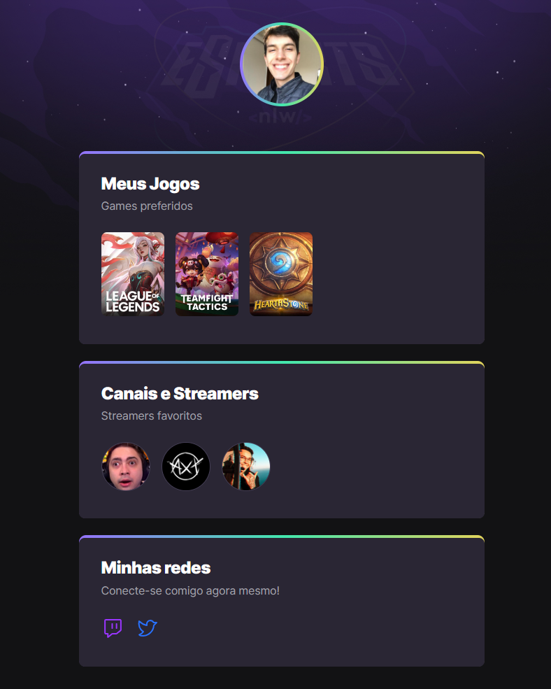

#NLW eSports

> Explorer

Projeto construído do evento Next Level Week da Rocketseat.

[🔍 Clique aqui para acessar](https://jeancdt.github.io/nlw-esports-explorer/)

## ⚙ Tecnologias

- HTML
- CSS
- Git e Github

## 💬 O que aprendi

- Introdução ao html
    - Colocar imagens
    - Colocar links
    - Criar blocos e segmentos

- Introdução ao css
    - Resetar pré configurações do explorador
    - Formatação da imagem + borda
    - Animação básica

- Introdução ao git e github
    - Adicionar arquivos ao github
    - Colocar preview
    - Adicionar colocações

## 🙋🏻‍♂️ Contato

jeancdetoni@gmail.com